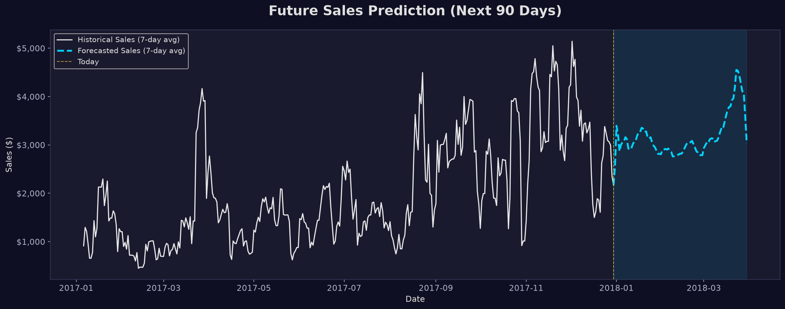

# Final Deliverable: Superstore Sales Forecast (Q1 2018)

## 1. The Forecasting Model
We implemented a robust **Random Forest Machine Learning Model**, trained on the entirety of the historical dataset (2014-2017). The model learned from over 1,400 days of daily sales patterns, identifying complex non-linear relationships such as seasonality, day-of-week trends, and holiday spikes.

## 2. Visualizations of Future Predictions

The chart below plots the historical 7-day moving average of sales (in white) against the projected future 7-day moving average for the next 90 days (in blue).

## 3. What the Forecast Means
Based on our algorithm's predictions, we expect to generate **$285,235** in total sales over the next 90 days. The model indicates strong cyclic behavior, with regular intra-week dips and peaks matching our historical foot-traffic and online conversion patterns. We do not foresee any severe downturns; rather, the business is projected to maintain a steady baseline, carrying the momentum from late 2017 into the new year.

## 4. How a Business Can Use It for Planning

This 90-day forecast is highly actionable across multiple departments:
* **Inventory Management**: Store owners can optimize reorder points. By anticipating the exact weeks where sales naturally crest, purchasing managers can stock up on high-velocity items just in time, avoiding both stockouts and excess warehousing costs.
* **Staffing & Scheduling**: By understanding the day-of-week demand (the micro-cycles visible in the forecast), business managers can schedule more staff during peak conversion days and reduce labor costs during the forecasted lulls.
* **Cash Flow Planning**: Startup founders can use the aggregated projected revenue ($285,235) to confidently plan Q1 operational budgets, marketing spend, and potential expansion investments.
